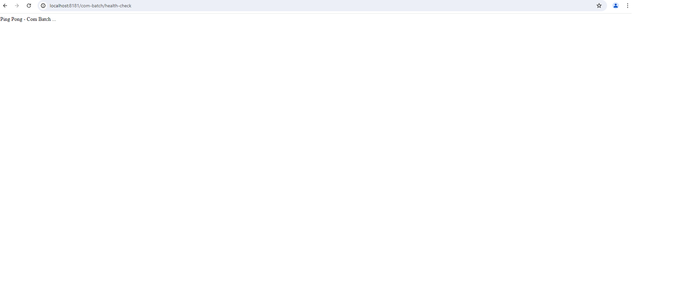
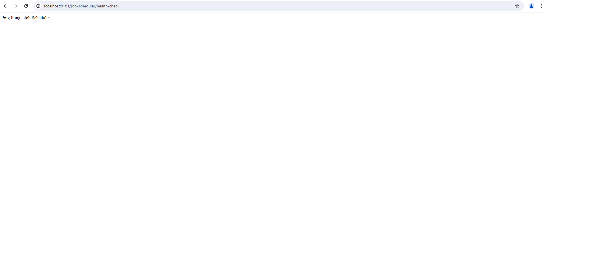

# SKCC KMS AI - RA-JAVA-FRAMEWORK-WORK-BATCH

# Getting Started Guide
## Introduction

Welcome to [RA-JAVA-FRAMEWORK-WORK-BATCH]!
This project document will guide you through setting up the project, so you can get started quickly. Whether you're contributing or just using the project, this guide will help you get up and running.
This project contains the following functions for work batch: Job Scheduler, Batch.

## Prerequisites

- JDK 21
- Docker and Docker Compose
- Gradle 8.12.1 (or use the included Gradle wrapper)

## Project Structure

The project consists of the following modules:

- `com-batch` - Main service implementation
- `job-scheduler` - Contains APIs related to job scheduler 
- `account-export` - Contains shared DTOs and interfaces
- `common-export` - Common utilities and shared components

## Setup & Installation

1. Clone the repository:

```bash
git clone <repository-url>
cd work-batch
```

2. Start the required dependencies using Docker Compose:

```bash
# start services: zookeeper, kafka, kafka-ui, redis, mysql
docker-compose -f docker-compose.yml up -d
```

3. Initialize the database:

```bash
# List all container
  docker ps

# Run mysql container - change equivalent <container_id> value	
  docker exec -it <container_id> bash

# Login mysql
  mysql -u root -p

# Input MySql password

# Run the SQL files
# Create Database
  CREATE DATABASE OCO;
  CREATE DATABASE quartz;

# Create User
  CREATE USER 'com_dev'@'%' IDENTIFIED BY 'qwer1234!';

# Grant permission
  GRANT ALL PRIVILEGES ON OCO.* TO 'com_dev'@'%';  
  GRANT ALL PRIVILEGES ON quartz.* TO 'com_dev'@'%';

  FLUSH PRIVILEGES;
```

4. Connect by IDE

You can also connect to the MySQL container using an IDE tool like MySQL Workbench or another IDE that supports MySQL.
The setup steps are as follows:

- Open MySQL Workbench or the IDE you want to use.
- Set up a new connection with the following information:
    - **Hostname**: 127.0.0.1 (localhost)
    - **Port**: 3307
    - **Username**: com_dev
    - **Password**: qwer1234!


- Test Connection: Check the connection to ensure you can access the MySQL server.
  You maybe need to set 'allowPublicKeyRetrieval=true' if necessary.

Once the connection is successful, you can use the graphical interface of the IDE to manage databases, perform SQL
queries, and interact with the data more easily.

5. Build the project:

```bash
./gradlew clean build
```

## Running the Application

1. Start the service:

```bash
./gradlew :com-batch:bootRun
```

2. The main service will be available at `http://localhost:8181/com-batch/health-check`
   

3. The Job Scheduler service will be available at `http://localhost:8181/job-scheduler/health-check`
   

## Development

- Use `./gradlew build` to build all modules
- Use `./gradlew bootRun` to run the service locally

## Database Setup

The project includes SQL scripts for initial setup in `folder` `init-database`:

- `menu.sql` Menu related data
- `query.sql` User related data
- `query_batch.sql` Job Scheduler related data

Logic ERD


Physic ERD


## Additional Resources

- Check the README.md file for more detailed information
- Refer to individual module documentation for specific details
- See docker-compose files for infrastructure setup

## Troubleshooting

- If you encounter database connection issues, ensure the database container is running
- Check log for detailed error messages in `logs` folder