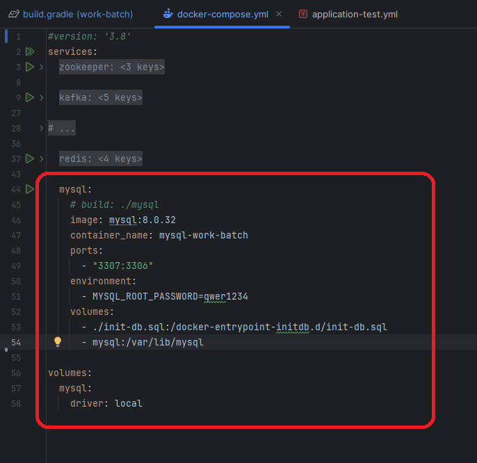
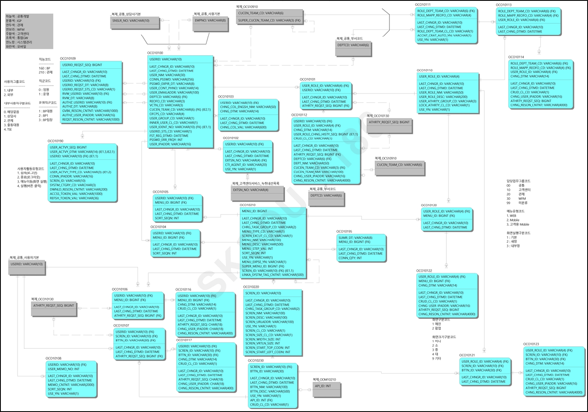

# RA-JAVA-FRAMEWORK-WORK-BATCH

# Getting Started Guide
## Introduction

This project is a batch processing and job scheduling solution written in Java (Spring Boot). Based on our analysis of the codebase, it automates account management, schedules and runs jobs, and supports data-handling tasks across multiple modules. It can run on MySQL or H2 databases, and uses Docker Compose for local setup and Gradle for building.

Key features identified:
- Account creation and permission assignment
- Automated batch tasks with Spring Boot Batch
- Job scheduling using Quartz
- Shared DTOs and common utilities for consistent data handling
- Configurable environment settings via YAML and database scripts
- Containerization support with Docker
- H2 in-memory database option for development or testing
- Integrations with external modules like job-scheduler, account-export, and common-export

## Prerequisites

- JDK 17
- Docker and Docker Compose
- Gradle 8.12.1 (or use the included Gradle wrapper)

## Project Structure

The project consists of the following modules:

- `com-batch` - Main service implementation
- `job-scheduler` - Contains APIs related to job scheduler 
- `account-export` - Contains shared DTOs and interfaces
- `common-export` - Common utilities and shared components

## Installation and Setup

1. Clone the repository:

```bash
git clone <repository-url>
cd ra-java-framework-work-batch
```

2. Start the required dependencies using Docker Compose:

```bash
# start services: zookeeper, kafka, mysql
docker-compose -f docker-compose.yml up -d
```

3. Initialize the database:

> [!NOTE]
>
> If you prefer to use the H2 database instead of mysql, please comment out the MySQL service in the docker-compose.yml file. 
> Then, skip this step and proceed to the section titled "Running the Application with H2 Database."



```bash
# List all container
  docker ps

# Run mysql container
  docker exec -it mysql-work-batch bash

# Login mysql
  mysql -u root -p

# Input MySql password (qwer1234)

# Run the SQL files
# Create Database
  CREATE DATABASE OCO;
  CREATE DATABASE quartz;
  CREATE DATABASE OIF;
  CREATE DATABASE OOM;

# Create User
  CREATE USER 'com_dev'@'%' IDENTIFIED BY 'qwer1234!';

# Grant permission
  GRANT ALL PRIVILEGES ON OCO.* TO 'com_dev'@'%';  
  GRANT ALL PRIVILEGES ON quartz.* TO 'com_dev'@'%';
  GRANT ALL PRIVILEGES ON OIF.* TO 'com_dev'@'%';
  GRANT ALL PRIVILEGES ON OOM.* TO 'com_dev'@'%';

  FLUSH PRIVILEGES;
```

4. Connect by IDE

You can also connect to the MySQL container using an IDE tool like MySQL Workbench or another IDE that supports MySQL.
The setup steps are as follows:

- Open MySQL Workbench or the IDE you want to use.
- Set up a new connection with the following information:
    - **Hostname**: 127.0.0.1 (localhost)
    - **Port**: 3307
    - **Username**: com_dev
    - **Password**: qwer1234!


- Test Connection: Check the connection to ensure you can access the MySQL server.
  You maybe need to set 'allowPublicKeyRetrieval=true' if necessary.

Once the connection is successful, you can use the graphical interface of the IDE to manage databases, perform SQL
queries, and interact with the data more easily.

After init schema and user, you must run sql script in 5 sql files (`query.sql`, `menu.sql`, `query_batch.sql`, `job_scheduler.sql`, `common_export.sql` in the folder `init-database`).

First, run the script command in the `query.sql` file to create the tables.

Then, run the script command in the `menu.sql` file to add sample data for the menu configuration.

Then, run the script command in the `query_batch.sql`

Then, run the script command in the `job_scheduler.sql`

Then, run the script command in the `common_export.sql`

5. Build the project:

```bash
./gradlew clean build
```

> [!NOTE]
> 
> In case you get error `./gradlew: Permission denied` you should try to run one of these command  
>
>    -``sudo chmod +x ./gradlew``
>    
>    -``git update-index --chmod=+x gradlew``
> 
> Then retry from step 2 above.

## Running the Application

1. Start the service:

```bash
./gradlew :com-batch:bootRun
```

> [!NOTE]
>
> You can also run project in IDE likes IntelliJ, Eclipse, ...
> In case you get error when starting this project, you should check the project config:
> - JDK version
> - Gradle config
> - Proxy prevention
> - Try to remove '.gradle' folder inside project and rebuild gradle in step 2 (Build the project)

## Running the Application with H2 Database

1. Start the service:

```bash
./gradlew :com-batch:bootRun -Pprofile=test
```

2. The main service will be available at `http://localhost:8080/actuator/health`
3. H2 Console `http://localhost:8080/h2-console`
- Set up config login H2 Console:
    - **Saved Settings**: Generic H2 (Embedded)
    - **Setting Name**: Generic H2 (Embedded)
    - **Driver Class**: org.h2.Driver
    - **JDBC URL**: jdbc:h2:mem:quartz
    - **User Name**: sa
    - **Password**:


## Development

- Use `./gradlew build` to build all modules
- Use `./gradlew bootRun` to run the service locally

## Database Setup

The project includes SQL scripts for initial setup in `folder` `init-database`:

- `query.sql` Database dump
- `menu.sql` Menu related data
- `query_batch.sql` Job Scheduler related data
- `job_scheduler.sql` Table Job Scheduler related
- `common_export.sql` Table Common

Logic ERD


Physic ERD


## Related Repositories

- [ra-java-framework-common](https://github.com/skccmygit/ra-java-framework-common) API Management / Menu Management / Code Management / File Management / etc.
- [ra-java-api-gateway](https://github.com/skccmygit/ra-java-api-gateway) API Gateway

## Guide for Using the erd.json File
1. File location
```
    docs/
        ├── db/
        │   └── schema_*.erd.json
```

2. Install the `ERD Editor` Extension
- In VS Code:
  - Go to Extensions (left sidebar).
  - Search for “ERD Editor”.
  - Click Install.

3. Open `schema_*.erd.json` in the ERD Editor
- In VS Code’s Explorer, click on `schema_*.erd.json` then wait a moment for this extension rendering schema diagram.
- Visualize or edit your diagram. The tool should display entities and relationships.

## Instructions Test API
> [!NOTE]
> The project includes sample data for testing.

### Test API - Job Scheduler

- Save Job API
```
curl --location 'localhost:8080/job-scheduler/saveJob' \
--header 'Content-Type: application/json' \
--data '{
    "jobId": 1,
    "jobName": "Sample Job",
    "jobGroup": "DEFAULT_GROUP",
    "jobInfoStatus": "STARTED",
    "jobClass": "com.skcc.ra.scheduler.job.MyBatchJob",
    "cronExpression": "0 0/1 * * * ?",
    "description": "Sample job description",
    "startTime": "2025-04-15 09:59:00",
    "repeatInterval": 30000,
    "repeatCount": 1,
    "cronJob": true,
    "lastModifiedBy": "adminUser",
    "lastModifiedAt": "2025-04-15 10:00:00",
    "jobParameters": [
        {
            "id": 101,
            "paramKey": "paramKey",
            "paramValue": "paramValue"
        }
    ]
}'
```
Result for request Save Job API
```
Status: 200 OK
{
    "valid": true,
    "message": null,
    "data": null
}
```

- Get All Jobs API
```
localhost:8080/job-scheduler/getAllJobs
```

## Additional Resources

- Check the README.md file for more detailed information
- Refer to individual module documentation for specific details
- See docker-compose files for infrastructure setup

## Troubleshooting

- If you encounter database connection issues, ensure the database container is running
- Check log for detailed error messages in `logs` folder

