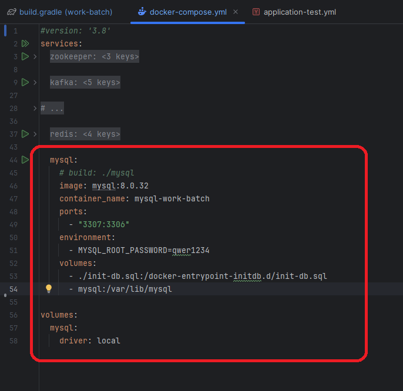
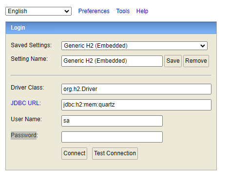
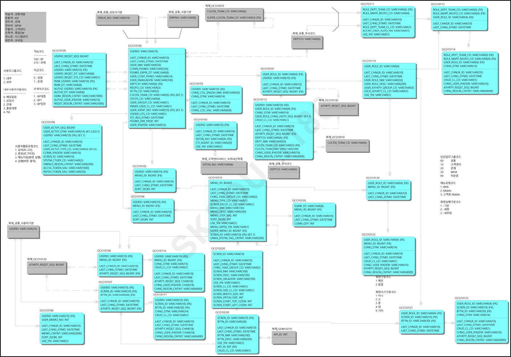
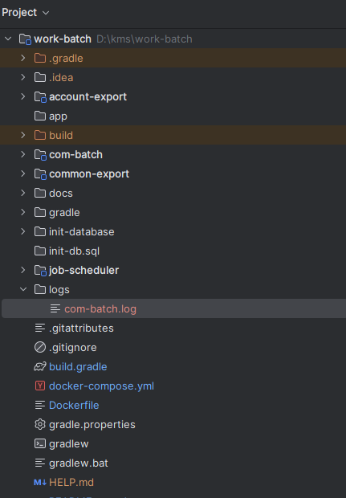

# RA-JAVA-FRAMEWORK-WORK-BATCH

# 시작하기 가이드
## 소개

이 프로젝트는 다음과 같은 작업 스케줄링 및 배치 작업을 수행합니다
- 부서와 직무에 따라 시스템 사용이 필요한 구성원의 계정을 자동 생성
- 사용자 기본 권한 자동 매핑
- 사용자 기본 권한에 따른 메뉴 및 버튼 접근 권한 부여
- 퇴사한 직원들의 계정 삭제
- 주기적으로 비밀번호 변경을 알림


## 사전 준비 사항

- JDK 17
- Docker 및 Docker Compose
- Gradle 8.12.1 (또는 제공된 Gradle Wrapper 사용)

## 프로젝트 구조

이 프로젝트는 다음과 같은 모듈로 구성됩니다:

- `com-batch` - 메인 서비스 구현
- `job-scheduler` - Job Scheduler 관련 API 포함
- `account-export` - 공유 DTO와 인터페이스
- `common-export` - 공통 유틸리티 및 공유 컴포넌트

## 설치 및 설정

1. 저장소를 클론합니다:

```bash
git clone <repository-url>
cd ra-java-framework-work-batch
```

2. 필요한 도구를 Docker Compose로 시작합니다:

```bash
# zookeeper, kafka, mysql 서비스 시작
docker-compose -f docker-compose.yml up -d
```

3. 데이터베이스 초기화:

> [!NOTE]
>
> mysql 대신 H2 데이터베이스를 사용하려면, docker-compose.yml 파일에서 MySQL 서비스를 주석 처리하고, 
> "Running the Application with H2 Database" 섹션으로 바로 이동하세요.



```bash
# 실행 중인 컨테이너 목록 확인
  docker ps

# mysql 컨테이너 접속
  docker exec -it mysql-work-batch bash

# mysql 접속
  mysql -u root -p

# MySql 비밀번호(qwer1234) 입력

# SQL 파일 실행
# 데이터베이스 생성
  CREATE DATABASE OCO;
  CREATE DATABASE quartz;
  CREATE DATABASE OIF;
  CREATE DATABASE OOM;

# 사용자 생성
  CREATE USER 'com_dev'@'%' IDENTIFIED BY 'qwer1234!';

# 권한 부여
  GRANT ALL PRIVILEGES ON OCO.* TO 'com_dev'@'%';  
  GRANT ALL PRIVILEGES ON quartz.* TO 'com_dev'@'%';
  GRANT ALL PRIVILEGES ON OIF.* TO 'com_dev'@'%';
  GRANT ALL PRIVILEGES ON OOM.* TO 'com_dev'@'%';

  FLUSH PRIVILEGES;
```

4. IDE로 연결하기

MySQL Workbench나 다른 IDE 툴을 이용해 MySQL 컨테이너에 접속할 수 있습니다.  
다음 정보를 이용해 새 연결을 설정하세요:

- **Hostname**: 127.0.0.1 (localhost)
- **Port**: 3307
- **Username**: com_dev
- **Password**: qwer1234!

- 연결 테스트: MySQL 서버에 제대로 접속되는지 확인하세요.  
  필요하다면 'allowPublicKeyRetrieval=true'를 설정해야 할 수도 있습니다.

스키마와 사용자 생성을 마친 후에는 5개의 SQL 파일(`query.sql`, `menu.sql`, `query_batch.sql`, `job_scheduler.sql`, `common_export.sql`)을 순서대로 실행하세요.

1) `query.sql` 파일로 테이블 생성  
2) `menu.sql` 파일로 메뉴 구성 샘플 데이터 추가  
3) `query_batch.sql` 실행  
4) `job_scheduler.sql` 실행  
5) `common_export.sql` 실행

5. 프로젝트 빌드:

```bash
./gradlew clean build
```

> [!NOTE]
>
> 만약 `./gradlew: Permission denied` 오류가 발생한다면, 아래 명령어 중 하나를 실행한 뒤
>
>    -``sudo chmod +x ./gradlew``
>    
>    -``git update-index --chmod=+x gradlew``
>
> 다시 2단계(프로젝트 빌드)를 진행해 보세요.

## 애플리케이션 실행

1. 서비스 시작:

```bash
./gradlew :com-batch:bootRun
```

> [!NOTE]
>
> IntelliJ, Eclipse 등 IDE에서 프로젝트를 실행해도 됩니다.  
> 실행 과정에서 오류가 발생하면 다음 항목을 확인하세요:  
> - JDK 버전  
> - Gradle 설정  
> - 프록시 설정  
> - 프로젝트 내부의 `.gradle` 폴더 삭제 후 빌드 재시도

## H2 데이터베이스로 애플리케이션 실행

1. 서비스 시작:

```bash
./gradlew :com-batch:bootRun -Pprofile=test
```

2. 메인 서비스는 `http://localhost:8080/actuator/health` 에서 사용 가능합니다.  
3. H2 콘솔 `http://localhost:8080/h2-console`  
- H2 콘솔 설정 예시:
    - **Saved Settings**: Generic H2 (Embedded)
    - **Setting Name**: Generic H2 (Embedded)
    - **Driver Class**: org.h2.Driver
    - **JDBC URL**: jdbc:h2:mem:quartz
    - **User Name**: sa
    - **Password**: (비워둠)



## 개발

- `./gradlew build` 명령어로 모든 모듈 빌드
- `./gradlew bootRun` 명령어로 로컬에서 서비스 실행

## 데이터베이스 설정

`init-database` 폴더에 초기 설정용 SQL 스크립트가 포함되어 있습니다.

- `query.sql` 데이터베이스 덤프
- `menu.sql` 메뉴 관련 데이터
- `query_batch.sql` 잡 스케줄러 관련 데이터
- `job_scheduler.sql` 잡 스케줄러 관련 테이블
- `common_export.sql` 공통 테이블

논리 ERD


물리 ERD


## 관련 저장소

- [ra-java-framework-common](https://github.com/skccmygit/ra-java-framework-common) API 관리 / 메뉴 관리 / 코드 관리 / 파일 관리 / 기타
- [ra-java-api-gateway](https://github.com/skccmygit/ra-java-api-gateway) API 게이트웨이

## erd.json 파일 사용 안내
1. 파일 위치
```
    docs/
        ├── db/
        │   └── schema_*.erd.json
```

2. `ERD Editor` 확장 기능 설치
- VS Code에서:
  - 왼쪽 사이드바의 **Extensions** 아이콘 클릭
  - “ERD Editor” 검색
  - **Install** 버튼 클릭

3. `schema_*.erd.json` 파일 열기
- VS Code 탐색기에서 `schema_*.erd.json`을 클릭 후, ERD Editor 확장 기능이 다이어그램을 렌더링할 때까지 잠시 대기
- 엔티티와 관계를 시각화하거나 편집 가능

## 추가 자료

- 각 모듈의 문서를 확인하여 세부 사항을 확인하세요.
- 인프라 설정은 docker-compose 파일을 참고하세요.

## 문제 해결

- DB 연결 문제가 발생하면, 데이터베이스 컨테이너가 정상 작동 중인지 확인하세요.
- `logs` 폴더 내 로그 파일을 확인하여 자세한 에러 메시지를 확인하세요.


